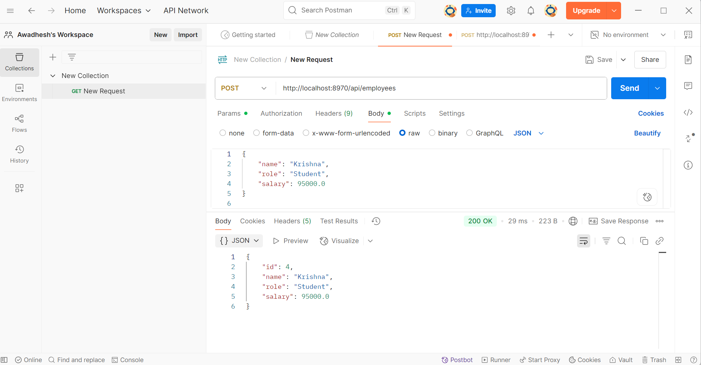
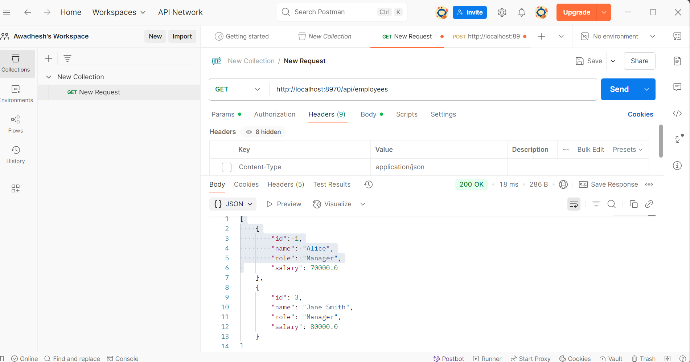
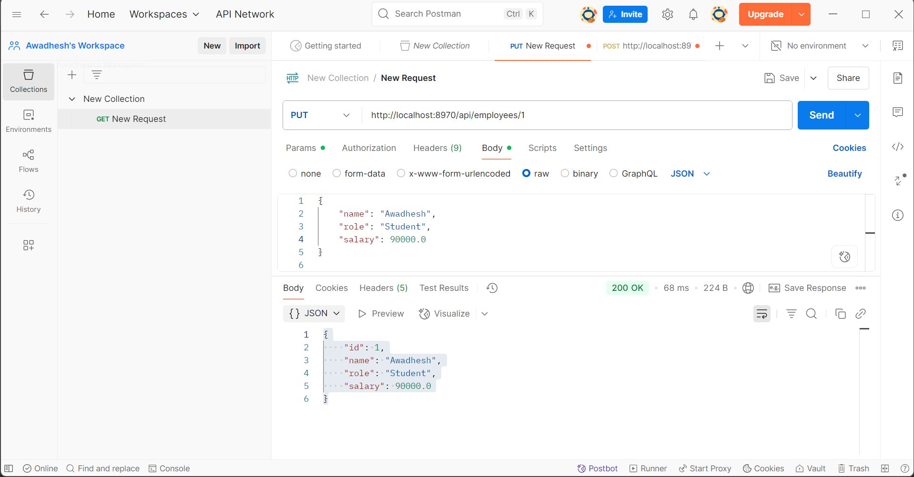
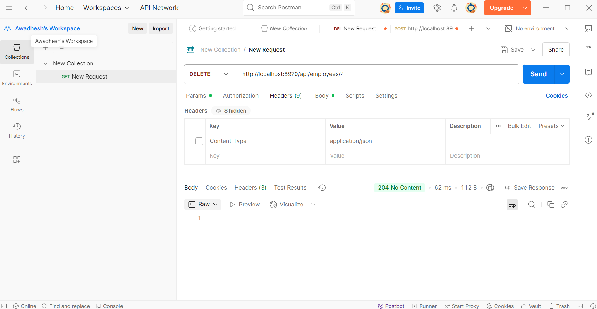
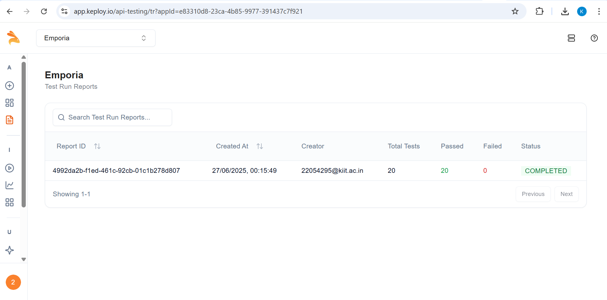

# Employee API

This README provides a comprehensive guide to using and testing the Employee API built with Spring Boot. The application manages employee data, allowing users to create, retrieve, update, and delete employee records.

## API Overview
The Employee API provides the following functionalities:
- Add new employees
- Fetch all employees or a specific employee by ID
- Update existing employee records
- Delete employee records

## Tech Stack
- **Backend Framework**: Spring Boot (Java)
- **Database**: MySQL
- **Build Tool**: Maven
- **Testing Frameworks**: JUnit 5, Mockito
- **Code Coverage Tool**: JaCoCo
- **API Testing Tool**: Postman

## Project Structure
```
public-apis-collection/
├── src/
│   ├── main/
│   │   ├── java/
│   │   │   └── com/
│   │   │       └── example/
│   │   │           └── employeeapi/
│   │   │               ├── controller/
│   │   │               │   └── EmployeeController.java
│   │   │               ├── model/
│   │   │               │   └── Employee.java
│   │   │               ├── repository/
│   │   │               │   └── EmployeeRepository.java
│   │   │               ├── service/
│   │   │               │   └── EmployeeService.java
│   │   │               └── EmployeeApiApplication.java
│   │   └── resources/
│   │       └── application.properties
│   └── test/
│       ├── java/
│       │   └── com/
│       │       └── example/
│       │           └── employeeapi/
│       │               └── service/
│       │                   └── EmployeeControllerIntegrationTest.java
│       │                   └── EmployeeServiceTest.java
├── pom.xml
└── README.md
```

## Setup Instructions

### Prerequisites
- Java 20 or higher
- Maven 3.8+
- MySQL database
- Postman (optional, for API testing)

### Running the Application

1. Clone the repository:
   ```bash
   git clone https://github.com/Awadhesh-Gupta/custom-api.git
   cd public-apis-collection
   ```

2. Configure the database:
   - Update the `application.properties` file with your MySQL database details:
     ```properties
     spring.datasource.url=jdbc:mysql://localhost:8970/employeesdb
     spring.datasource.username=EmployeeDb
     spring.datasource.password=Awadhesh9844#
     spring.jpa.hibernate.ddl-auto=update
     ```

3. Build and run the application:
   ```bash
   mvn spring-boot:run
   ```

4. The application will start on `http://localhost:8970`.

## API Endpoints

### Base URL
```
http://localhost:8970/api/employees
```

### Endpoints

#### 1. Get All Employees
- **Method**: `GET`
- **URL**: `/`

#### 2. Get Employee by ID
- **Method**: `GET`
- **URL**: `/{id}`

#### 3. Create a New Employee
- **Method**: `POST`
- **URL**: `/`
- **Headers**:
  ```
  Content-Type: application/json
  ```
- **Body**:
  ```json
  {
      "name": "Jane Smith",
      "role": "Manager",
      "salary": 80000.0
  }
  ```

#### 4. Update an Employee
- **Method**: `PUT`
- **URL**: `/{id}`
- **Headers**:
  ```
  Content-Type: application/json
  ```
- **Body**:
  ```json
  {
      "name": "Jane Doe",
      "role": "Senior Manager",
      "salary": 90000.0
  }
  ```

#### 5. Delete an Employee
- **Method**: `DELETE`
- **URL**: `/{id}`

## Testing the API with Postman

### Steps to Test Endpoints:
1. **Install Postman**:
   - Download and install Postman from [Postman](https://www.postman.com/).

2. **Set Up a New Request**:
   - Open Postman and create a new request.
   - Choose the appropriate HTTP method (`GET`, `POST`, `PUT`, `DELETE`).
   - Enter the endpoint URL (e.g., `http://localhost:8970/api/employees`).

3. **Add Headers (if required)**:
   - For POST and PUT requests, add the following header:
     ```
     Content-Type: application/json
     ```

4. **Add Request Body (for POST and PUT)**:
   - In the "Body" tab, choose "raw" and select JSON format.
   - Provide the required fields.
     ```json
     {
         "name": "Jane Smith",
         "role": "Manager",
         "salary": 80000.0
     }
     ```

5. **Send the Request**:
   - Click on "Send" and observe the response.

### Example: Testing POST Endpoint
- **URL**: `http://localhost:8970/api/employees`
- **Body**:
  ```json
  {
      "name": "Jane Smith",
      "role": "Manager",
      "salary": 80000.0
  }
  ```
- **Response**:
  ```json
  {
      "id": 2,
      "name": "Jane Smith",
      "role": "Manager",
      "salary": 80000.0
  }
  ```

---

## Test Results

Screenshots of Postman test results to validate API functionality. 

### Example: POST Request


### Example: GET Request


### Example: PUT Request


### Example: DELETE Request



## Test Results

### Keploy AI API Testing Dashboard

Below is the screenshot of the Keploy test results validating the API functionality:



---

### CI/CD Configuration

The CI/CD pipeline configuration file can be found here: [CI/CD Configuration](https://github.com/Awadhesh-Gupta/custom-api/blob/CustomAPI/.github/workflows/keploy-ci.yml)

## 📄 License

This project is licensed under the MIT License.

---

👨‍💻 **Author**
Built with ❤️ by [Awadhesh Gupta Kaulapuri]
